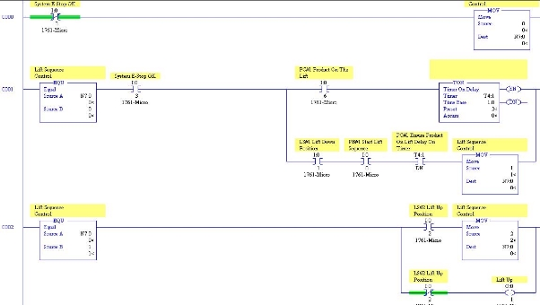
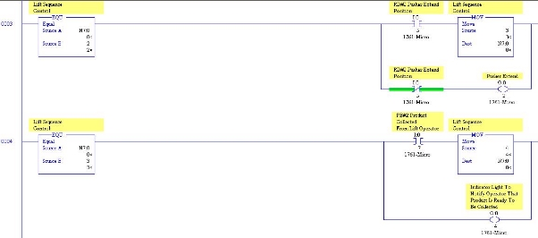
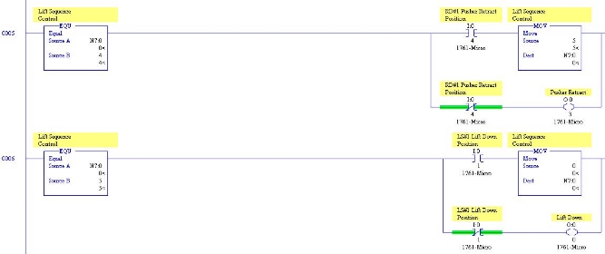
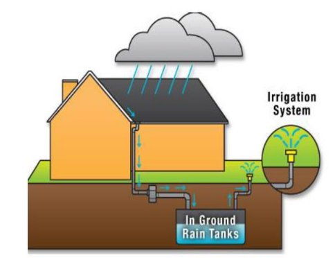
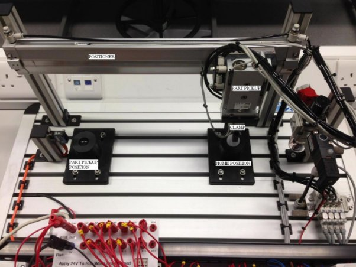
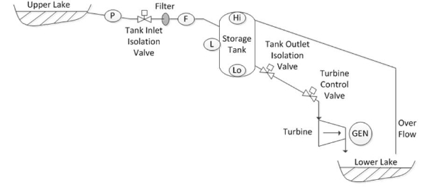
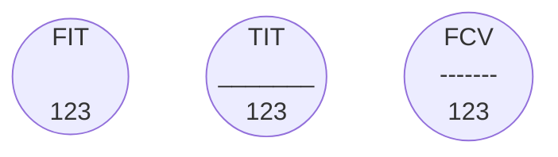
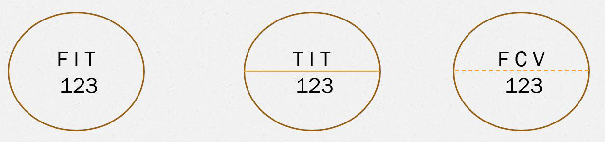


# Advanced PLCs, HMI & SCADA - Exam Paper - 2019 - Spring

**Instructions**:  Answer question 4 and 5, and any other two questions. All questions carry equal marks.

The use of programmable or text storing calculators is expressly forbidden.

Please note that where a candidate answers more than the required number of questions, the examiner will mark all questions attempted and then select the highest scoring ones.  

## Paper College Details

College: Limerick Institute of Technology  
Module Title: Advanced PLCs, HMI & SCADA  
Module Code: AUTM07018
Year of Study: 3  
Year: 2019 - Spring  
Time Allowed: 2.5 Hours  
File Name: exam-2019-advanced-plcs-hmi-and-scada-autm07018.md

### Programmes

| Code           | Programme                                                  |
|----------------|------------------------------------------------------------|
| LC\_ERENM\_KMY | BEng (Honours) Renewable and Electrical Energy Engineering |
| LC\_ERENM\_JMY | BEng Renewable and Electrical Energy Engineering           |
| LC\_EIARM\_KMY | BEng (Honours) Industrial Automation & Robotic Systems     |
| LC\_EIARM\_JMY | BEng Industrial Automation & Robotic Systems               |
| LC\_EEETM\_KMY | BEng (Honours) Electrical Engineering                      |
| LC\_EEETM\_JMY | BEng Electrical Engineering                                |

### Examiners

| Examiner         |          |
|------------------|----------|
| Ian Foley        | Internal |
| Denis O Meara    | Internal |
| Mr. Mark McGrath | External |

## Question 1 (Total Marks: 25)

### Question 1(a) (5 Marks)

Identify two Rockwell Automation PLC programming software. Describe how the Rockwell Automation Software communicates with PLCs and I/O devices.

#### Question 1(a) Answer

Rockwell Automation has two main PLC programming software:

1. **RSLogix 5000/Studio 5000**: This software is used for programming Rockwell Automation's ControlLogix and CompactLogix family of controllers.
2. **RSLogix 500**: This software is used for programming Rockwell Automation's SLC 500 and MicroLogix family of controllers.

### Question 1(b) (20 Marks)

Explain in detail the operation of the sections of the PLC program shown in **Figure.1**

> Figure.1

#### Question 1(b) Answer

#### Answer:
To explain the operation of the PLC program shown in the provided figures, I will analyze each section of the program based on the images provided.

1. **Figure 1-a**:
   - **Rung 0000**: This rung is controlling the `System R1` relay. The `System R1 Relay Off` condition is checked, and if it is not active (relay is off), the relay is activated. This indicates that the system is initially turned on.
   - **Rung 0001**: This rung controls the `Left Sequence Control` relay. It checks if `SPMA Extend On Lft` is active. If the `SPMA Extend On Lft` is active, it triggers the `Left Lift Down` sequence and the `PMA Start Lft` sequence.
   - **Rung 0002**: This rung continues the `Left Sequence Control`. It checks for `SPMA Extend Out` condition and proceeds to activate the `Left Lift Up Position` when `Left Lift Down` sequence is completed.

2. **Figure 1-b**:
   - **Rung 0003**: This rung handles the `Left Sequence Control`. It checks if `KMC Valve Extend Position` is reached. If true, it continues to `KMC Valve Extend Position`.
   - **Rung 0004**: This rung handles `Left Sequence Control`. It verifies if `PSM Extend On Lft` and `KMC Valve Extend Position` are active. If both conditions are met, the `Left Sequence` relay is triggered to proceed further.
   - **Rung 0005**: This rung handles another section of the `Left Sequence Control`. It checks if `ECM Pusher Retract Position` is active and then sets the `Left Lift Down Position` to proceed to the next step in the sequence.

3. **Figure 1-c**:
   - **Rung 0006**: This rung involves the `Left Sequence Control`. It checks if `ECM Pusher Retract Position` is true, activating the `Left Sequence Control MOP`.
   - **Rung 0007**: This rung checks for `ECM Pusher Retract Position` and if `Left Lift Down Position` is reached, the `Left Sequence Control` is updated accordingly.

Overall, the program handles a sequential control system for a left lift mechanism. The steps involve extending and retracting various components (e.g., `SPMA`, `KMC Valve`, `ECM Pusher`), and moving the lift up and down based on specific position feedback. The sequences are controlled by checking various position sensors and relays to ensure the correct order of operations.

This detailed analysis provides a comprehensive understanding of how the PLC program manages the sequential operations for the lift mechanism.

## Question 2 (Total Marks: 25)

Design a PLC program for a water harvester as outlined below. Create the PLC program using TIA Portal.

**Operation:**  

An overview of the process is shown above. The process continually maintains a level in the two tanks, which can be taken in or out of service, to supply water to two processes within the plant, rain water supplied to the tanks is collected from factory roof, filtered and stored in an underground storage tank.  

**Automatic mode (auto):**  

Control panel in automatic S3(A), operation started by pressing S2 start and stopped by pressing S1. If the tanks are in service S4(on) tank 1 S5(on) tank 2 and water is available in storage B1on, the process can start filling tanks 1& 2 when called by Level switch B2, B3, B4 and B5.  

**Tank 1 fill-**  

Auto on and tank 1 in service and B1 on and tank 1 calling for water, pump M1 starts and 3 seconds later DV opens, when pump on and DV open V1 opens to allow water into tank 1, tank 1 fills, when level reached B3, V1 off, also DV and Pump M1 if not supplying Tank 2.  

**Tank 2 fill**-  

Auto on and tank 2 in service and B1 on and tank 2 calling for water, pump M1 starts and 3 seconds later DV opens, when pump on and DV open V2 opens to allow water into tank 2 , tank 2 fills when level reached B5, V2 off, also DG and Pump M1 if not supplying Tank 1.  

**Manual mode (Man):**  

Control panel in manual/Hand S3 (H), will allow, via the manual screen on HMI to manually operate the, Valves DV, V1 and V2 at any time to allow for testing/Maintenance of system also to operate pump M1 on condition B1 indicates it’s safe to do so.  

**Safety protection:**  

**Overloads:** Operation of the overload M1, will stop the process, immediately all contactors will be de-energised and Lamp H2 constant, until reset.  

**E/S1:** Operation of the E/S1, will stop the process, immediately all contactors will be de-energised and Lamp H2 Flash, until reset.  

**PLC Tags (Water Harvester)**  

| PLC -Tag         | Data Type | PLC\_Address | NO/NC |
|------------------|-----------|--------------|-------|
| ES1- emergency   | DI-Bool   | I0.0         | 2xNC  |
| stop 1           |           |              |       |
| S1 STOP          | DI-Bool   | I0.1         | NC    |
| S2 START         | DI-Bool   | I0.2         | NO    |
| S3 HAND          | DI-Bool   | I0.3         | NO    |
| S3 AUTO          | DI-Bool   | I0.4         | NO    |
| S4 TANK 1 IN     | DI-Bool   | I0.5         | NO    |
| SERVICE          |           |              |       |
| S5 TANK 2 IN     | DI-Bool   | I0.6         | NO    |
| SERVICE          |           |              |       |
| KM1 AUX          | DI-Bool   | I0.7         | NO    |
| F1 O/L           | DI-Bool   | I1.0         | NO    |
| B1 STORAGE       | DI-Bool   | I1.1         | NO    |
| TANK LOW         |           |              |       |
| B2 TANK 1 LOW    | DI-Bool   | I1.2         | NO    |
| B3 TANK 1 HIGH   | DI-Bool   | I1.3         | NO    |
| B4 TANK 2 LOW    | DI-Bool   | I1.4         | NO    |
| B5 TANK 2 HIGH   | DI-Bool   | I1.5         | NO    |
| PUMP             | DO-Bool   | Q0.0         |       |
| H2 OL/ES         | DO-Bool   | Q0.1         |       |
| H3-DISCHARGE     | DO-Bool   | Q0.2         |       |
| VALVE(DV)        |           |              |       |
| H4- PUMP RUNNING | DO-Bool   | Q0.3         |       |
| H5 -VALVE 1      | DO-Bool   | Q0.4         |       |
| H6-VALVE 2       | DO-Bool   | Q0.5         |       |

## Question 3 (Total Marks: 25)

**Process Description**  

A control system is required to move a part from the ‘Part Pickup Position’ to the ‘Home Position’ once the system is placed in Auto and the Start button is pressed. There are three valves controlling actuators with Reed switches to feedback whether the actuator is extended or retracted. The system configuration is represented by the image below: **Figure.2**

> Figure 2

The sequence is as follows:

Once placed in Auto Mode and the start button is pressed the system will move in a safe manner to the home position. Once a part is detected the positioner will extend, then the part pickup will extend, clamp the part and return to the home position and place the part for collection by the operator.

There are 3 valves controlling actuators with feedback on the cylinders.

<u>Ball Clamp (Inputs)</u>

**Clamp Activated (I40.4)**  
**Clamp Deactivated (I40.3)**  

<u>Ball Clamp (Outputs)</u>

**Activate Clamp (Q50.1)**  

<u>Part Pickup (Inputs)</u>

**Part Pickup Extended (I40.2)**  
**Part Pickup Retracted (I40.1)**  

<u>Part Pickup (Outputs)</u>

**Extend Part Pickup (Q50.0)**  

<u>Positioner (Inputs)</u>

**Positioner Extended (I40.6)**  
**Positioner Retracted (I40.5)**  

Positioner (Outputs)</u>

**Extend Positioner (Q50.3)**  
**Retract Positioner (Q50.2)**  

<u>Interlocks</u>

**Pressure Switch  (I40.7) E-Stop  (I41.6)**  
**Stop Pushbutton  (I41.5) Auto Selector Switch (I50.0) Part Present (I40.0)**  

<u>Sequence Step Value</u>

Sequence Step **(MW100)**  

<u>Operator Interface</u>

1. **Start Pushbutton (I41.3)**  
2. **Stop Pushbutton  (I41.5)**  
3. **Auto Selector Switch (I50.0)**  
4. **Index Pushbutton (I41.4)**  
5. **Reset Pushbutton (I41.2)**  
6. **Lamp Indicator System Running (Q50.5)**  

Sketch and clearly explain a structured programme to implement the application in **Figure.2** above using a Siemens S7 PLC. Create Symbol table for all I/O and internal bits used in the PLC code. **[6 Marks]**

***Operation***  

1. Initialise an Auto Mode to begin Sequence control. (Auto Mode M0.0).
   Activate indicator Lamp for system running. **[3 Marks]**
2. Activate Outputs from Sequence Control. **[4 Marks]**
3. Program Sequence Control and transition to next step when transition interlock is met **[8 Marks]**
4. Reset Sequence when not in Auto and Index Pushbutton is pressed and held for 2 secs **[2 Marks]**
5. After part is placed in the home position ensure that another part is not placed there until the index push has been pressed by the operator to indicate that the part in the home position has been removed. (Part in home position M0.1) **[2 Marks]**

## Question 4 (Total Marks: 25)

A client currently has a hydroelectric generation facility which uses water from the upper lake to generate power to support peak production demands, as illustrated in Figure 3. The client wants to update their current control system to ensure they can expand their current PLC control and SCADA monitoring capabilities, and allow for future expansion.  

> Figure 3

The client has requested detailed information in the sections of question 5 below, with regard to investing in a Fieldbus network to connect the I/O and control devices to the PLC/SCADA system.

### Question 4(a) [7 Marks]

The distance from the furthest control item at the upper lake to the control room is approximately 600 metres. It has been estimated from the current system that approximately 50 fieldbus nodes would be required to connect the existing I/O and control devices in the system. However, future expansion of the control system is anticipated so the client has suggested that at least 50% future expansion capability should be provided on the fieldbus network, in order to accommodate future fieldbus nodes being added to the control system.

1. Suggest a suitable Fieldbus type that would meet the client’s needs. Support your answer with a detailed explanation of how the fieldbus system will function and why this fieldbus type would be suitable for the requested system.

#### Question 4(b) Answer

The client should consider using the **PROFIBUS** fieldbus system. PROFIBUS is a fieldbus network that is widely used in industrial automation systems. It is a digital communication system that allows for the communication of field devices with the control system. PROFIBUS is suitable for the client's system because it is a robust and reliable fieldbus system that can handle the long distances between the control items at the upper lake and the control room. It is also capable of handling a large number of field devices, which makes it suitable for the client's system.

### Question 4(b) (4 Marks)

Give possible advantages and disadvantages of using fieldbus in this hydroelectric system and support your answer with a brief explanation for each suggestion.

### Question 4(c) [4 Marks]

Describe and illustrate the chosen fieldbus cable in detail. Show the location of the terminating resistors in the system.

### Question 4(d) [6 Marks]

Due to the early stages of design for the new control system, it is undecided whether
a single or multi master station will be used in the Fieldbus network. Explain using
diagrams how cyclic communication would be initiated and controlled in:

1. Single Master system communicating with a number of slave devices
2. Multi Master System communicating with a number of slave devices

### Question 4(e) [4 Marks]

One of the control devices to be used in the system is a turbine control valve. This
control device will be required to be a slave on the fieldbus network. Explain the
function of the required data file used to incorporate such a device on a fieldbus
network.

## Question 5 (Total Marks: 25)

### Question 5(a) [4 Marks]

Explain the function of a P&ID diagram and describe using an example the function of device tag descriptors and numbering.

### Question 5(b) [3 Marks]

Instrument location can be shown on a P&ID diagram using the presence, absence or type of a line within the circle, as illustrated in Figure 4.

> Figure 4

1. List the instrument location when no line is present#
2. List the instrument location when a solid line is present
3. List the instrument location when a broken line is present.

### Question 5(c) [8 Marks]

A client has sought expertise on investing in OPC connectivity. They have a number of data sink applications that require data from industrial source devices, and they request the following.

1. Explain to the client the benefits of investing in and using OPC connectivity
2. Explain the types of data that OPC supports

### Question 5(d) [6 Marks]

Explain the functionality of an OPC server. Include a diagram to support your
explanation, illustrating the conceptual view of the inner workings of the OPC server.

### Question 5(e) (4 Marks)

Explain the types of data sources that OPC servers communicate with.

Sure! Here is the diagram in both Mermaid and PlantUML formats.
